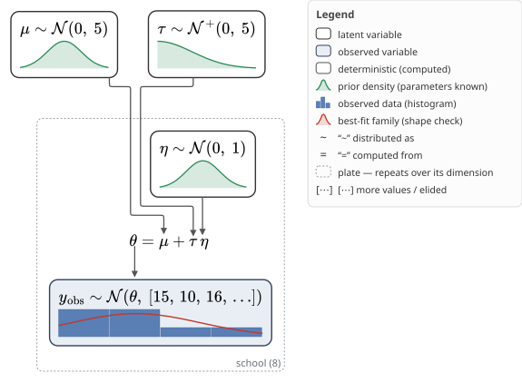

# bayesdag

**Shape-first, posterior-aware, interactive visualizations of PyMC models.**

`bayesdag` renders a PyMC model as a rich generative-model diagram where **every node shows the full shape of its distribution** — so you can read the data-generating story off the curves (Kruschke-style) — with real **LaTeX math inside nodes**, **edges that point at the specific parameter** they feed, and prior/posterior overlays. It has a **static SVG renderer** (publication-quality) and an **interactive [anywidget](https://anywidget.dev)** renderer (Jupyter + [marimo](https://marimo.io)); both consume the same layout pass and the same rendered math, so the diagram itself is identical, and it falls back to static automatically when interactivity isn't available.

> **Status: pre-alpha.** M0 (the vertical slice) has landed and PyMC distribution coverage is complete; the posterior-geometry explorer and the interop exporters are not built yet. See [`COVERAGE.md`](COVERAGE.md) for the live work-plan and [`docs/RESEARCH.md`](docs/RESEARCH.md) for background.

## Install

```bash
pip install "bayesdag[interactive]"     # or: uv add "bayesdag[interactive]"
```

Requires Python ≥ 3.12 (PyMC 6's own floor). No system packages are needed: the layout engine (ELK) and the math renderer (MathJax) both run in-process. Extras: `[interactive]` (the notebook widget), `[export]` (PNG/PDF via cairosvg, needs a system cairo). The Graphviz `dot` binary is optional and only used by the explicit `BAYESDAG_LAYOUT=dot` rollback path.

## Quickstart

```python
import numpy as np, pymc as pm, bayesdag

J = 8
y = np.array([28., 8, -3, 7, -1, 1, 18, 12])
sigma = np.array([15., 10, 16, 11, 9, 11, 10, 18])

with pm.Model(coords={"school": [f"S{i}" for i in range(J)]}) as model:
    mu = pm.Normal("mu", 0, 5)
    tau = pm.HalfNormal("tau", 5)
    eta = pm.Normal("eta", 0, 1, dims="school")
    theta = pm.Deterministic("theta", mu + tau * eta, dims="school")
    y_obs = pm.Normal("y_obs", theta, sigma, observed=y, dims="school")

v = bayesdag.view(model)             # interactive in a notebook, static SVG elsewhere
v.save("eight_schools.svg")          # .svg, or .png/.pdf with the [export] extra

idata = pm.sample(model=model)
bayesdag.view(model, idata=idata)    # nodes gain posterior overlays
```

`view(...)` also takes `var_names=[...]`, which restricts the diagram to those variables plus their direct parents — the same semantics as `pm.model_to_graphviz(var_names=…)`.



## What you see (glyph legend)

Every node carries a **density curve** as its primary mark — the shape is the point, and any interval or point summary is an annotation on top of it, never a substitute (those annotations are M2). The legend says where each shape came from:

- **prior density (parameters known)** — the family density with the node's real numeric parameters plugged in.
- **prior shape (depends on parents)** — a hierarchical prior whose parameters are themselves random. Drawn as a fixed, parameter-free schematic (grey, dashed): sampling a shape through the parents would produce a different, misleading curve on every render.
- **posterior (from idata)** — a KDE from a fitted `InferenceData`; per-class bars for a discrete variable.
- **observed data** — a histogram (auto-binned) with an MLE best-fit family curve overlaid, or per-class bars for a discrete likelihood. Never a KDE.
- **transfer function** — for a `pm.Deterministic`, the canonical shape of the function it computes, drawn only when that shape is provable from the op graph.

Roles are distinguished by fill and border rather than by outline shape — every node is a rounded rectangle, which reads better with math labels inside than an ellipse does. Constructs that can't be drawn honestly get an "elided" badge naming the reason, rather than a misleading picture.

## Roadmap

- **M0** ✅ — vertical slice: 8-schools in both renderers, LaTeX nodes, port-edges, prior/posterior/observed glyphs, fallback.
- **M1** — PyMC coverage: every published distribution renders (verified against `pm.distributions.__all__`). Remaining: `pm.Potential` factor glyphs, transforms-as-badges, nested submodels, `pm.do`/`pm.observe`, missing-data imputation.
- **M2** — posterior-geometry explorer (funnels/divergences), workflow toggle, prior linter, distribution cards.
- **M3** — interop exporters (GraphML/PROV), reparameterization suggestions, scale, cross-PPL (`from_numpyro`), upstreaming to PyMC.

## License

MIT — see [`LICENSE`](LICENSE). The distributed wheel also bundles elkjs (EPL-2.0) and MathJax (Apache-2.0); their notices travel with it in [`THIRD_PARTY_LICENSES`](THIRD_PARTY_LICENSES).
